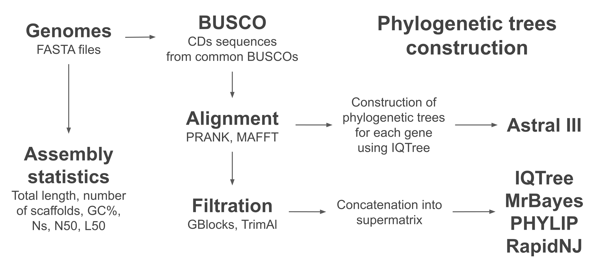

# Snakemake workflow: BuscoClade

[](https://snakemake.github.io)
[](https://opensource.org/licenses/MIT)

## Description

Pipeline to construct species phylogenies using [BUSCO](https://busco.ezlab.org/).



- Alignment: [PRANK](http://wasabiapp.org/software/prank/), [MAFFT](https://mafft.cbrc.jp/alignment/software/).
- Trimming: [GBlocks](https://academic.oup.com/mbe/article/17/4/540/1127654), [TrimAl](http://trimal.cgenomics.org/).
- Phylogenetic tree constraction: [IQTree](http://www.iqtree.org/), [MrBayes](https://nbisweden.github.io/MrBayes/), [ASTRAL III](https://bmcbioinformatics.biomedcentral.com/articles/10.1186/s12859-018-2129-y), [RapidNJ](https://birc.au.dk/software/rapidnj), [PHYLIP](https://phylipweb.github.io/phylip/).
- Visualization: [Etetoolkit](http://etetoolkit.org/), [Matplotlib](https://matplotlib.org/stable/).

## Usage

### Step 1. Deploy workflow

To use this workflow, you can either download and extract the [latest release](https://github.com/tomarovsky/BuscoClade/releases) or clone the repository:

```
git clone https://github.com/tomarovsky/BuscoClade.git
```

### Step 2. Add species genomes

Place your unpacked FASTA genome assemblies into the `genomes/` directory. Keep in mind that the file prefixes will influence the output phylogeny. Ensure that your files have a `.fasta` extension.

### Step 3. Configure workflow

To set up the workflow, modify `config/default.yaml`. I recommend to copy config gile and do all modifications in this copy. Some of the options (all nonested options from default.yaml) could also be set via command line using `--config` flag. Sections of config file:

- **Pipeline Configuration:**
This section outlines the workflow. By default, it includes alignments and following filtration of nucleotide sequences, and all tools for phylogeny reconstruction, except for MrBayes (it is recommended to run the GPU compiled version separately). To disable a tool, set its value to `False` or comment out the corresponding line.

  **NB!** When constructing a phylogeny using the Neighbor-Joining (NJ) method with PHYLIP, ensure that the first 10 characters of each species name are unique and distinct from one another.

- **Tool Parameters:**
Specify parameters for each tool. To perform BUSCO, it is important to specify:
  - `busco_dataset_path`: Download the BUSCO dataset beforehand and specify its path here.
  - `busco_params`: Use the `--offline` flag and the `--download_path` parameter, indicating the path to the `busco_downloads/` directory.

- **Directory structure:**
Define output file structure in the `results/` directory. It is recommended to leave it unchanged.

- **Resources:**
Specify Slurm queue, threads, memory, and runtime for each tool.

### Step 4. Execute workflow

For a dry run:

```
snakemake --profile profile/slurm/ --configfile config/default.yaml --dry-run
```

Snakemake will print all the rules that will be executed. Remove `--dry-run` to initiate the actual run.

**How to run the workflow if I have completed BUSCOs?**

First, move the genome assemblies to the ` genomes/` directory or create empty files with corresponding names. Then, create a `results/busco/` directory and move the BUSCO output directories into it. Note that BUSCO output must be formatted. Thus, for `Ailurus_fulgens.fasta` BUSCO output should look like this:

```
results/
    busco/
        Ailurus_fulgens/
            busco_sequences/
                fragmented_busco_sequences/
                multi_copy_busco_sequences/
                single_copy_busco_sequences/
            hmmer_output/
            logs/
            metaeuk_output/
            full_table_Ailurus_fulgens.tsv
            missing_busco_list_Ailurus_fulgens.tsv
            short_summary_Ailurus_fulgens_DNAzoo.txt
            short_summary.json
            short_summary.specific.mammalia_odb10.Ailurus_fulgens.json
            short_summary.specific.mammalia_odb10.Ailurus_fulgens.txt
```

## Contact

Please email me at: <andrey.tomarovsky@gmail.com> for any questions or feedback.

